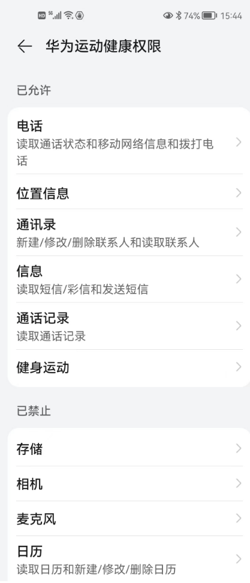

# 操作系统的访问控制设计实例研究操作系统的访问控制设计实例研究

## 实验目的

以 IOS 和 Android 系统为研究对象，对操作系统的访问控制进行研究。

## 实验环境

- 操作系统版本：Harmony OS 2.0.0
- 手机版本型号：荣耀30

## 实验过程

### 当系统处于锁屏状态下接收到新短信时

- 不解锁情况下系统是否允许查看短信内容？

    否
  

- 系统是否允许回复短信？
  
    否，需要先解锁手机

-  安卓上的 App : 以 华为运动健康 为例，在接管了系统短信功能和权限之后，是否会有一些不同的功能设定？

    会显示需要修改手机默认设置，使用系统自带时，只可读而不可回复

### 当系统处于锁屏状态下，使用系统内置（例如 iOS 的 Siri ）或第三方的语音助手可以完成以下哪些操作？

- 访问通讯录 
  
    否

- 拨打电话
  
    否

- 访问相册

    否

- 查看短信收件箱
  
    否

均需要先解锁手机

### 实验并分析指纹识别相比较于简单密码、复杂密码、图形解锁、人脸识别解锁、声纹解锁等解锁方式的安全性、便利性差异

| 密码类型  | 安全性  |  便利性|
|  ----  | ----  | ----|
简单密码 |	小于指纹解锁，可被分析破解或者统计破解	| 容易记住，比较方便
复杂密码 |分析破解更不容易，但是安全性还是没有指纹高	| 输入较为麻烦，记忆也不方便
图形解锁 |有可能被穷举分析，指纹则不存在此种攻击方式	| 解锁需要画图，相较指纹不容易
人脸识别解锁 | 人脸识别主要是特征识别，安全性在特征唯一的情况下可以保证	| 方便，只需要人脸对着摄像头即可，但是可能受光线的影响
声纹解锁 | 容易伪造	| 需要说话，在安静的环境不方便
指纹解锁 |指纹不容易出现重复，复制指纹不容易实现，安全性较好 | 比较方便，手指一按就解锁，但是有时候手湿会影响准确性

### 思考题

- 以上设计实现方式属于我们课堂上讲过的哪种强制访问控制模型？Lattice/BLP？Biba？

    Biba模型，可以上读下写，锁屏时只能读短信，属于上读；解开屏幕以后，可以回复短信，属于下写

- 系统或第三方应用程序是否提供了上述功能的访问控制规则修改？如果修改默认配置，是提高了安全性还是降低了安全性？

    是，例如微信，可以修改权限。是降低了安全性，可以通过对不同App应用赋予不同的权限控制从而实现不同层级的安全性控制。

## 课后题

### 生物特征身份认证方式有哪些？优缺点分析？应用场景举例。

|  认证方式  | 优点  | 缺点 | 应用 |
|  ----  | ----  | ---- | ---- |
|  指纹识别  | 速度快，应用方便，指纹是独一无二的特征，且复杂度较高，具有稳定性和可靠性  | 对手指的湿度、清洁度等都很敏感，脏、油、水都会造成识别不了或影响到识别的结果，会造成识别困难、识别率低的问题 | 手机解锁，移动支付，身份验证 |
|  面部识别  | 用户不需要与设备直接的接触；可以使用桌面的视频摄像，且比较高级的摄像头还可以有效高速地捕捉面部图像  | 面部识别技术的改进依赖于提取特征与比对技术的提高，使用者面部的位置与周围的光环境都可能影响系统的精确性 | 手机解锁，学校出入身份认证 |
|  声音识别  |  声音识别也是一种非接触的识别技术 | 声音因为变化的范围太大，故而很难进行一些精确的匹配；声音会随着音量、速度和音质的变化(例如当你感冒时)而影响到采集与比对的结果 | 语音导航，手机语音助手，即时翻译 |
|  签名认证  | 是一种公认的身份识别的技术  | 不具有可靠的稳定性，在不同时期的签名可能会有改变 | 课签到，借条、合同等重要文件签名防抵赖 |
|  虹膜识别技术  | 便于用户使用，只需用户位于设备之前而无需物理的接触；可能会是最可靠的生物识别技术  | 没有进行过任何的测试，当前的虹膜识别系统只是用统计学原理进行过小规模的试验 | 门禁考勤，微软的Windows10用虹膜识别代替密码登录 |
|  视网膜识别技术  | 视网膜是一种极其固定的生物特征，因为它是“隐藏“的，故而不可能磨损、老化或是为疾病影响；使用者不需要与设备进行直接的接触  | 视网膜技术未经过任何测试，对于消费者，视网膜技术没有吸引力；很难进一步降低它的成本。 | 身份识别认证 |

### “找回口令功能”和“忘记密码”在访问授权机制中的意义？请尝试设计几种安全的“找回口令功能”，详细描述找回口令的用户具体操作过程。

【登录界面】>【忘记密码】>【输入个人手机号】>【发送验证码】>【在规定时间内查看并输入验证码】>【重置密码】>【在登录界面输入新修改的密码登录】

### 绘制用户使用用户名/口令+图片验证码方式录系统的流程图。考虑认证成功和失败两种场景，考虑授权成功和失败两种场景。

### Windows XP / 7 中的访问控制策略有哪些？访问控制机制有哪些？

基于角色的访问控制：一个身份被分配给一个被授权的组。在访问控制列表中，每一个用户或用户组都对应一组访问控制项。

强制访问控制：“Administrators”组的全部成员都拥有“更改用户的权限”(Take Ownership)的权力。

自主访问控制：所有用户或用户组的权限访问设置都会被存储下来，并允许随时被有权限进行修改的用户进行调整，如取消某个用户对某个资源的“写入”权限。

### 用权限三角形模型来理解并描述下 2 种威胁模型：提权、仿冒。

权限三角形模型：用户-角色（分级-权限（对象+操作）

提权：提权分为水平特权提升和垂直特权提升。 提权是指本来没有某项权限的用户，通过一定的方法获得该权限

提权是用户-角色-权限，角色不变，而获取的权限扩大

仿冒：仿冒是指用户A以用户B的身份通过了认证，之后行使了B所有的权利 

仿冒是用户-角色，获取的角色改变，能够行使的权限因角色的改变而改变

### 试通过操作系统的访问控制机制来达到预防一种真实病毒的运行目的。

对于一个系统服务，管理员正确配置其调用的可执行文件的读写权限使得低权限用户没有对其程序的写入权限。这样就可以避免这个程序被病毒替换成任意可执行程序。

### 什么是 OAuth？

让用户告诉系统，同意第三方应用访问自己的一部分数据,系统从而产生一个令牌来认证与授权的一种协议。

### 什么是 OpenID？

允许用户使用一个已经存在的帐号来登录多个网站，而不必创建新的密码。

### 试用本章所学理论分析 0Auth 和 OpenID 的区别与联系。

oauth2用来授权，openid用来认证。openid提供对实体的鉴别，而OAuth有通用性。当一个服务向第三方服务发行一个令牌可以用来访问一个被保护资源的令牌时，只要拥有令牌就能够访问其被授予的资源。

### 如何使用 OAuth 和 OpenID 相关技术实现单点登录（Single Sign On）？

当用户第一次登录时，将用户名密码发送给用户服务。

验证用户将用户标识OpenId返回到客户端。

客户端进行存储。

访问子系统，将OpenId发送到子系统。

子系统将OpenId转发到验证服务。

验证服务将用户认证信息返回给子系统。

子系统构建用户验证信息后将授权后的内容返回给客户端。

## 参考链接

[在线课本](https://c4pr1c3.github.io/cuc-ns/chap0x02/main.html)