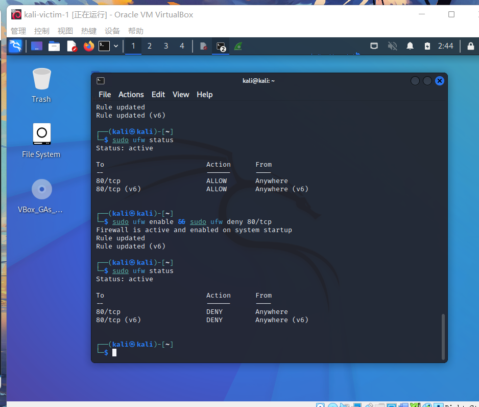
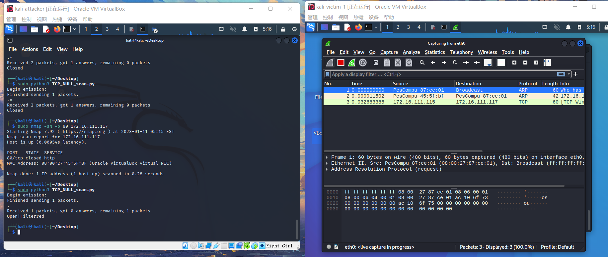
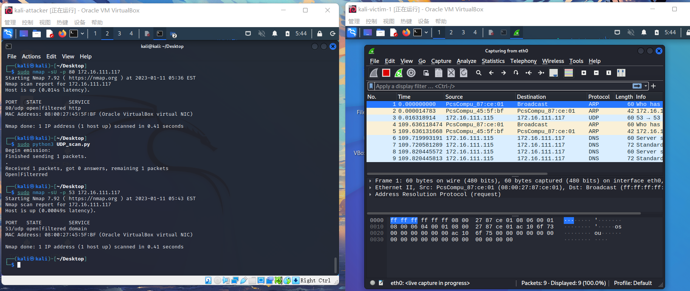

# 基于Scapy编写端口扫描器

## 实验目的

掌握网络扫描的端口状态探测的基本原理

## 实验环境

- python + scapy

## 实验要求

- 禁止探测互联网上的`IP`，严格遵守网络安全相关法律法规
- 完成以下扫描技术的编程实现
    - TCP connect scan / TCP stealth scan
    - TCP Xmas scan / TCP fin scan / TCP null scan
    - UDP scan
- 上述每种扫描技术的实现测试均需要测试端口状态为：开放、关闭 和 过滤 状态时的程序执行结果
- 提供每一次扫描测试的抓包结果并分析与课本中的扫描方法原理是否相符？如果不同，试分析原因；
- 在实验报告中详细说明实验网络环境拓扑、被测试 IP 的端口状态是如何模拟的
- （可选）复刻 nmap 的上述扫描技术实现的命令行参数开关

## 实验过程

### 网络配置

这里的网络配置同`chap0x04`相同，只是将`attacker`作为扫描端，`victim`作为被扫描的靶机。

### 端口状态的模拟

实验命令：
```
# 端口关闭
sudo ufw disable

# 端口开放
sudo ufw enable && sudo ufw allow 80/tcp
sudo ufw enable && sudo ufw allow 53/tcp

# 端口过滤
sudo ufw enable && sudo ufw deny 80/tcp
sudo ufw enable && sudo ufw deny 53/tcp

# 查看当前状态
sudo ufw status
```

实验目录：

- TCP connect scan
- TCP stealth scan
- TCP Xmas scan
- TCP FIN scan
- TCP NULL scan
- UDP scan


### TCP connect scan

先发送一个S，然后等待回应。如果有回应且标识为RA，说明目标端口处于关闭状态；如果有回应且标识为SA，说明目标端口处于开放状态。这时TCP connect scan会回复一个RA，在完成三次握手的同时断开连接。

```
from scapy.all import *

def tcpconnect(dst_ip, dst_port, timeout=10):
    pkts = sr1(IP(dst=dst_ip)/TCP(dport=dst_port,flags="S"),timeout=timeout)
    if(pkts is None):
        print("Filtered")
    elif(pkts.haslayer(TCP)):
        if(pkts.getlayer(TCP).flags == 0x12):  
            send_rst = sr(IP(dst=dst_ip)/TCP(dport=dst_port,flags="AR"),timeout=timeout)
            print("Open")
        elif(pkts.getlayer(TCP).flags == 0x14):  
            print("Closed")

tcpconnect('172.16.111.117', 80)
```
将代码保存为`.py`文件放在attacker的桌面上，然后运行

#### 端口关闭

```
sudo ufw disable
```


`nmap`复刻

```
nmap -sT -p 80 172.16.111.117
```


#### 端口开放

```
sudo ufw enable && sudo ufw allow 80/tcp
```


在wireshark的抓包中收到了被扫描端的SYN/ACK

RST与ACK同时发出，说明端口开启，和预期相符合。

`nmap`复刻

```
nmap -sT -p 80 172.16.111.117
```


#### 端口过滤

```
sudo ufw enable && sudo ufw deny 80/tcp
```


查看wireshark的抓包结果只有一个TCP包，说明端口处于过滤状态，与预期相符合

`nmap`复刻

```
nmap -sT -p 80 172.16.111.117
```


### TCP stealth scan

先发送一个S，然后等待回应。如果有回应且标识为RA，说明目标端口处于关闭状态；如果有回应且标识为SA，说明目标端口处于开放状态。这时TCP stealth scan只回复一个R，不完成三次握手，直接取消建立连接。

```
from scapy.all import *

def tcpstealthscan(dst_ip, dst_port, timeout=10):
    pkts = sr1(IP(dst=dst_ip)/TCP(dport=dst_port, flags="S"), timeout=10)
    if (pkts is None):
        print("Filtered")
    elif(pkts.haslayer(TCP)):
        if(pkts.getlayer(TCP).flags == 0x12):
            send_rst = sr(IP(dst=dst_ip) /
                          TCP(dport=dst_port, flags="R"), timeout=10)
            print("Open")
        elif (pkts.getlayer(TCP).flags == 0x14):
            print("Closed")
        elif(pkts.haslayer(ICMP)):
            if(int(pkts.getlayer(ICMP).type) == 3 and int(stealth_scan_resp.getlayer(ICMP).code) in [1, 2, 3, 9, 10, 13]):
                print("Filtered")

tcpstealthscan('172.16.111.117', 80)
```

#### 端口关闭

```
sudo ufw disable
```


`nmap`复刻

```
sudo nmap -sS -p 80 172.16.111.117
```


#### 端口开放

```
sudo ufw enable && sudo ufw allow 80/tcp
```


`nmap`复刻

```
sudo nmap -sS -p 80 172.16.111.117
```


#### 端口过滤

```
sudo ufw enable && sudo ufw deny 80/tcp
```


`nmap`复刻

```
nmap -sS -p 80 172.16.111.117
```


### TCP Xmas scan

当处于端口处于关闭状态时，会回复一个RST包；其余所有状态都将不回复。

```
from scapy.all import *

def tcpxmasscan(dst_ip, dst_port, timeout=10):
    pkts = sr1(IP(dst=dst_ip)/TCP(dport=dst_port, flags="FPU"), timeout=10)
    if(pkts is None):
        print("Open|Filtered")
    elif(pkts.haslayer(TCP)):
        if(pkts.getlayer(TCP).flags == 0x14):
            print("Closed")
    elif(pkts.haslayer(ICMP)):
        if(int(pkts.getlayer(ICMP).type) == 3 and int(pkts.getlayer(ICMP).code) in [1, 2, 3, 9, 10, 13]):
            print("Filtered")

tcpxmasscan('172.16.111.117', 80)
```

#### 端口关闭

```
sudo ufw disable
```


`nmap`复刻

```
nmap -sX -p 80 172.16.111.117
```


#### 端口开放

```
sudo ufw enable && sudo ufw allow 80/tcp
```


`nmap`复刻

```
nmap -sX -p 80 172.16.111.117
```


#### 端口过滤

```
sudo ufw enable && sudo ufw deny 80/tcp
```




`nmap`复刻

```
nmap -sX -p 80 172.16.111.117
```


### TCP FIN scan

仅发送FIN包，FIN数据包能够通过只监测SYN包的包过滤器，隐蔽性较SYN扫描更⾼，此扫描与Xmas扫描也较为相似，只是发送的包为FIN包，同理，收到RST包说明端口处于关闭状态；反之说明为开启/过滤状态。

```
from scapy.all import *

def tcpfinscan(dst_ip, dst_port, timeout=10):
    pkts = sr1(IP(dst=dst_ip)/TCP(dport=dst_port, flags="F"), timeout=10)
    if (pkts is None):
        print("Open|Filtered")
    elif(pkts.haslayer(TCP)):
        if(pkts.getlayer(TCP).flags == 0x14):
            print("Closed")
    elif(pkts.haslayer(ICMP)):
        if(int(pkts.getlayer(ICMP).type) == 3 and int(pkts.getlayer(ICMP).code) in [1, 2, 3, 9, 10, 13]):
            print("Filtered")

tcpfinscan('172.16.111.117', 80)
```

#### 端口关闭

```
sudo ufw disable
```


`nmap`复刻

```
nmap -sF -p 80 172.16.111.117
```


#### 端口开放

```
sudo ufw enable && sudo ufw allow 80/tcp
```


`nmap`复刻

```
nmap -sF -p 80 172.16.111.117
```


#### 端口过滤

```
sudo ufw enable && sudo ufw deny 80/tcp
```


`nmap`复刻

```
nmap -sF -p 80 172.16.111.117
```


### TCP NULL scan

发送的包中关闭所有TCP报⽂头标记，实验结果预期：收到RST包说明端口为关闭状态，未收到包即为开启/过滤状态.

```
from scapy.all import *

def tcpnullscan(dst_ip, dst_port, timeout=10):
    pkts = sr1(IP(dst=dst_ip)/TCP(dport=dst_port, flags=""), timeout=10)
    if (pkts is None):
        print("Open|Filtered")
    elif(pkts.haslayer(TCP)):
        if(pkts.getlayer(TCP).flags == 0x14):
            print("Closed")
    elif(pkts.haslayer(ICMP)):
        if(int(pkts.getlayer(ICMP).type) == 3 and int(pkts.getlayer(ICMP).code) in [1, 2, 3, 9, 10, 13]):
            print("Filtered")

tcpnullscan('172.16.111.117', 80)
```

#### 端口关闭

```
sudo ufw disable
```


`nmap`复刻

```
nmap -sN -p 80 172.16.111.117
```


#### 端口开放

```
sudo ufw enable && sudo ufw allow 80/tcp
```


`nmap`复刻

```
nmap -sN -p 80 172.16.111.117N
```


#### 端口过滤

```
sudo ufw enable && sudo ufw deny 80/tcp
```


`nmap`复刻

```
nmap -sN -p 80 172.16.111.117
```


### UDP scan

开放式扫描，通过发送UDP包进行扫描。当收到UDP回复时，该端口为开启状态；否则即为关闭/过滤状态.

```
from scapy.all import *

def udpscan(dst_ip, dst_port, dst_timeout=10):
    resp = sr1(IP(dst=dst_ip)/UDP(dport=dst_port), timeout=dst_timeout)
    if (resp is None):
        print("Open|Filtered")
    elif (resp.haslayer(UDP)):
        print("Open")
    elif(resp.haslayer(ICMP)):
        if(int(resp.getlayer(ICMP).type) == 3 and int(resp.getlayer(ICMP).code) == 3):
            print("Closed")
        elif(int(resp.getlayer(ICMP).type) == 3 and int(resp.getlayer(ICMP).code) in [1, 2, 9, 10, 13]):
            print("Filtered")
        elif(resp.haslayer(IP) and resp.getlayer(IP).proto == IP_PROTOS.udp):
            print("Open")

udpscan('172.16.111.117', 53)
```

#### 端口关闭

```
sudo ufw disable
```


`nmap`复刻

```
nmap -sU -p 53 172.16.111.117
```


#### 端口开放

```
sudo ufw enable && sudo ufw allow 53/tcp
```


`nmap`复刻

```
nmap -sU -p 53 172.16.111.117
```



#### 端口过滤

```
sudo ufw enable && sudo ufw deny 53/tcp
```


`nmap`复刻

```
nmap -sU -p 53 172.16.111.117
```


## 实验总结

`TCP connect`和`TCP stealth`在端口关闭时只收到一个RST包；端口开放时完成完整的三次握手，抓到ACK&RST包；端口过滤的状态	收不到任何TCP包

`TCP Xmas`、`TCP FIN`和`TCP NULL`在端口关闭时只收到一个RST包；端口开放和过滤状态均收不到TCP回复包

`UDP`在端口开放时能收到UDP回复包；端口关闭和过滤均收不到UDP回复包

## 实验问题

在使用命令`sudo ufw`时，出现了报错，查询是因为没有安装包


安装`ufw`

```
sudo apt-get update
sudo apt-get install ufw
sudo ufw enable
```

## 参考链接

[scapy端口扫描](https://resources.infosecinstitute.com/topic/port-scanning-using-scapy/)

[Scapy实现基于ARP/ICMP/TCP/UDP的活跃设备扫描技术，以及TCP全/半端口扫描](https://blog.csdn.net/qq_58784379/article/details/125735887)

[Nmap 端口扫描](https://blog.csdn.net/qq_46023525/article/details/112982178)